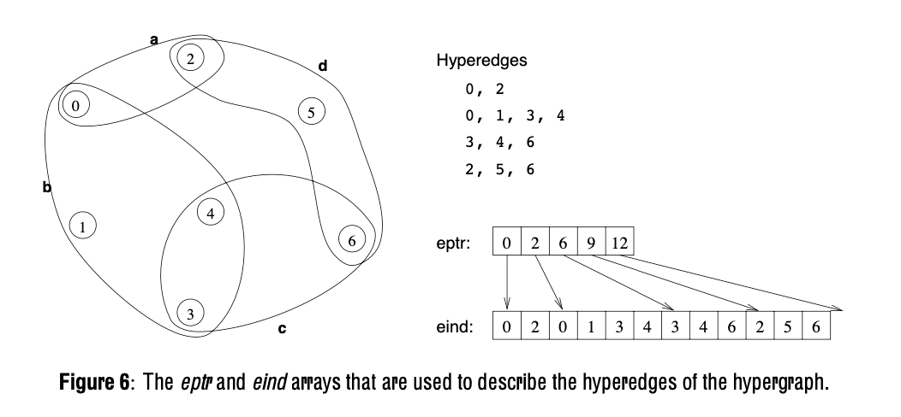

# metapartition
Generic partitioner wrapper, with a general-purpose hyper graph interface

Can run with or without hMetis.  For hMetis on a Mac, add some feature flags:

<pre>
cargo run --features=hmetis --target=x86_64-apple-darwin -- -h benches/fs-save000.hgr -H
</pre>

The features toggles on compile with hMetis.  have to target x86_64, as that's
what the old library is built for.  Command line switch of -H to select the
hMetis partitioner (KaHyPar by default).

Also need to set the rpath on the Mac.  WTF?

<pre>
install_name_tool -add_rpath /usr/local/lib target/release/metapartition

install_name_tool -add_rpath /usr/local/lib target/x86_64-apple-darwin/release/metapartition
</pre>

## File Formats

Hypergraph file formats are based on hMetis; the files
contain the number of edges and vertices, and then
each edge is on a line, listing the vertex numbers.

A couple of potential headaches on the formats.

* In many of the hMetis figures, the vertices are numbered starting with 1, but in the code, they start with 0.  So... not  all of the figures in the hMetis manual look right.  Figure 6 is the best one to look at.
* hMetis uses eptr to point into eind, and then eind contains vertex numbers.  KaHyPar uses the terminology differently, and the names are effectively reversed.  With metapartition, I'm trying to keep the naming consistent, and using the KaHyPar approach.  All the contents of the arrays are the same....  it's just the names that get weird.

Other gotchas...

* hMetis uses an integer value for imbalance; 1 is 1%, 2 is 2%
* KaHyPar uses a floating point number

The command line program takes inputs, reading hMetis formatted files.

* -h hypergraph file
* -f fixed vertex file
* -H switches from KaHyPar to hMetis partitioning (support for hMetis is enabled with Cargo.toml features)
* -b balance (floating point number, 0.01 for 1%, etc.)
* -s # (sets the random seed number)

